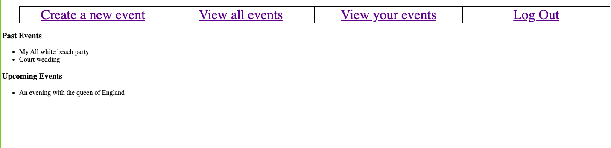

# Private Events

> Private Events is a web application built in Ruby on Rails that allows users to create events and send invitations for those events to other users. 


 
 This project is designed to demonstrate proficiency in managing complex data relationships in the Rails framework.

## Built With

- Ruby 
- Ruby on Rails
- SCSS
- MacOS


## Getting Started

To get a local copy up and running follow these simple example steps.

### Prerequisites

1. Ruby v.2.7.0
2. Rails 6.0.3.3

### Setup

1. Clone this repository by using the Terminal to navigate to the desired location on your computer and then enter the following line of code into the Terminal:
```
git clone git@github.com:Joseph-Burke/Private-Events.git
```
2. Run `cd Private-Events` to move inside the downloaded repository.
3. Run `bundle install` and `npm install` seperately to download the project's dependencies.
4. Run ` npm install -g npm-check` to install npm check and run `npm-check` to verify that the package dependencies have not been altered.
4. Run `rails db:migrate` to set up your local database.
5. Run `rails console` to open a console in the environment. From here you will be able to create, modify, update and delete users,events and attendees.


## Authors

👤 **Joe Burke**

- Github: [@Joseph-Burke](hhttps://github.com/Joseph-Burke)
- Twitter: [@__joeburke](https://twitter.com/__joeburke)
- Linkedin: [Joseph Burke](https://www.linkedin.com/in/--joeburke)


👤 **Maryjane Akpagbue**

- Github: [Maryjanee](https://github.com/Maryjanee)
- Twitter: [Maryjane Akpagbue](https://twitter.com/alfredmaryjane)
- Linkedin: [Maryjane Akpagbue](https://www.linkedin.com/in/maryjane-akpagbue)


## Contributing

- To contribute to this project:
- Fork this repository & clone locally.
- Create an upstream remote and sync your local copy.
- create a new branch.
- Push your code to your origin repository.
- Create a new Pull Request .
- Feel free to check the [issues page](https://github.com/Joseph-Burke/Private-Events/issues).

## Show your support

Give a ⭐️ if you like this project!

## Acknowledgments